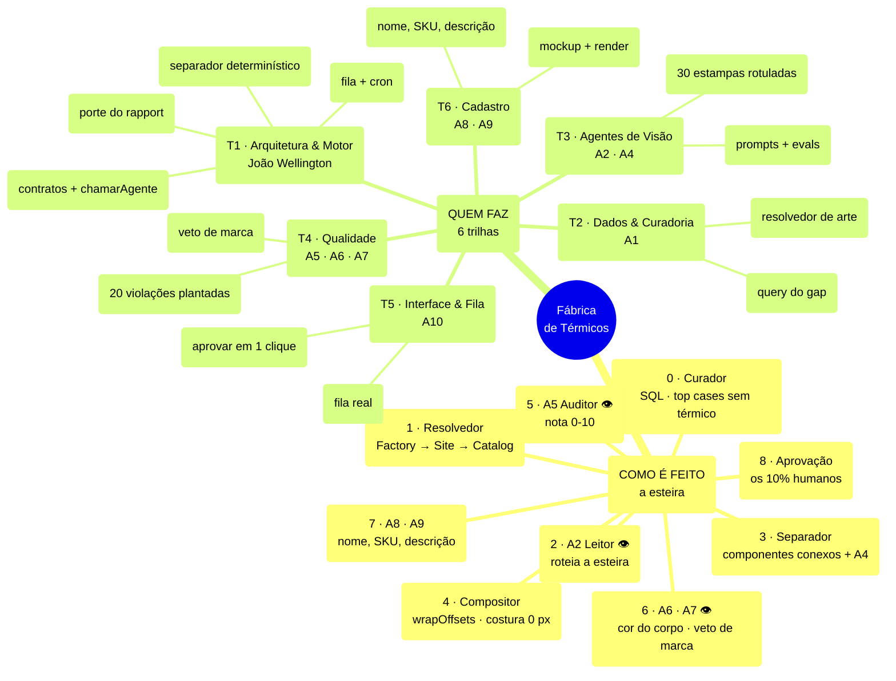
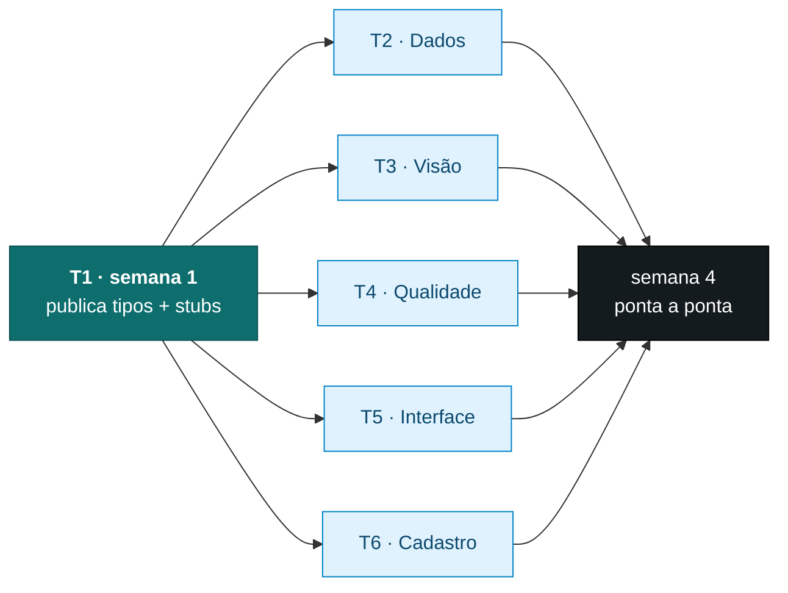

# Mapa mental — como é feito e quem faz

Versão navegável e editável: **https://quadro-termicos.devgogroup.com/**
(o app mostra o progresso vivo de cada trilha, vindo dos cards).

## Como seis pessoas trabalham ao mesmo tempo

O paralelismo não vem de dividir tarefas — vem de dividir **contratos**.

Cada trilha é dona de um diretório e de um contrato. Ninguém edita o arquivo de
outra: se precisar de mudança, abre PR com revisão do dono. Contrato quebrado em
silêncio é o que trava um time de seis.

| Contrato | Dono | Consumido por |
|---|---|---|
| `Camada {canvas, ox, oy, ow, oh, kind}` | T1 | T3, T4 |
| `LeituraEstampa` (JSON do A2) | T3 | T1, T4, T6 |
| `PlanoComposicao` (JSON do A3) | T3 | T1 |
| `ItemFila` + estados | T1 | T2, T5, T6 |
| `chamarAgente()` | T1 | T2, T3, T4, T6 |

## Marcos que destravam outra trilha

Estes cinco cards estão marcados como **marco** no board — atrasar um deles
para alguém, não só quem o executa:

1. **T1 · contratos e stubs** (semana 1) — destrava as outras cinco
2. **T3 · 30 estampas rotuladas** (semana 1) — sem isso não há como medir prompt
3. **T4 · 20 violações plantadas** (semana 1) — sem isso o veto do A7 é cego
4. **T1 · porte do rapport** (semana 3) — sem isso T5 não tem o que mostrar
5. **T6 · cadastro ponta a ponta** (semana 4) — fecha o ciclo
