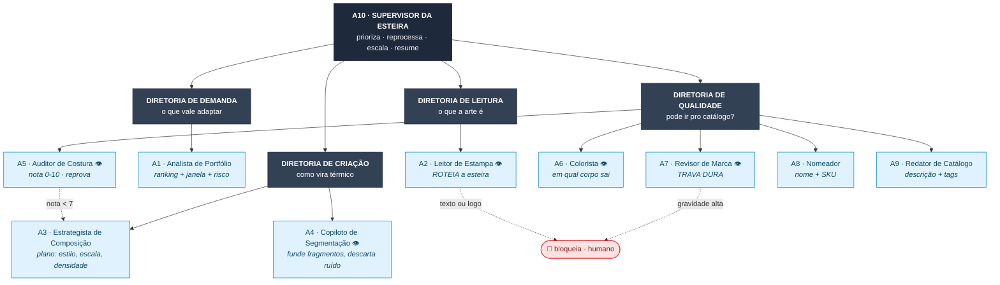
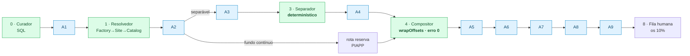

# Organograma das funções de IA

Dez agentes no AI Proxy, organizados em quatro diretorias sob um supervisor.
A leitura é hierárquica: o **A10 Supervisor** não executa arte — ele opera a
esteira e é o único que enxerga o estado global.

👁 = agente de visão (recebe imagem).

## Onde cada agente entra na esteira

Verde = determinístico. Azul = agente de IA.
A geometria (Separador e Compositor) é verde de propósito: é o que garante
costura com erro zero e a arte da best-seller preservada pixel a pixel.

## Divisão de responsabilidade

| Diretoria | Agentes | Pergunta que responde | Falha custa |
|---|---|---|---|
| Demanda | A1 | vale adaptar esta estampa? | esforço em arte que não vende |
| Leitura | A2 | o que esta arte é? | rota errada, retrabalho em cascata |
| Criação | A3, A4 | como ela vira térmico? | estampa feia, reprovada no A5 |
| Qualidade | A5-A9 | pode ir pro catálogo? | **produto errado publicado** |

O A7 (Revisor de Marca) é o único com poder de veto absoluto: `gravidade: alta`
bloqueia sempre, sem exceção automática. Licenciamento é o risco caro aqui.
